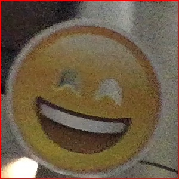
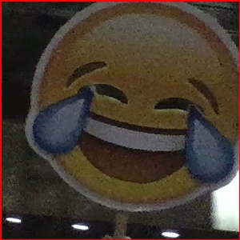
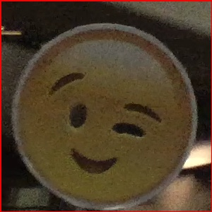
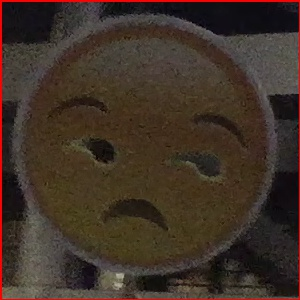
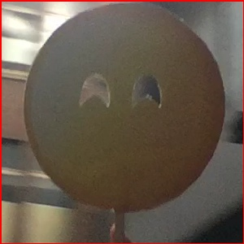

# emoji recognition by CNN

絵文字７種類＋裏面('null')＋絵文字なし('none')の９ラベルで学習．

kerasモデルで作成．構成は以下の通り．

```
model = Sequential()
model.add(Conv2D(12,kernel_size=(3,3),activation='relu',input_shape=(size,size,ch)))
model.add(MaxPooling2D(pool_size=(2,2)))
model.add(Conv2D(18,kernel_size=(3,3),activation='relu'))
model.add(MaxPooling2D(pool_size=(2,2)))
model.add(Conv2D(24,kernel_size=(3,3),activation='relu'))
model.add(MaxPooling2D(pool_size=(2,2)))
model.add(Flatten())
model.add(Dropout(0.3))
model.add(Dense(48,activation='relu'))
model.add(Dropout(0.3))
model.add(Dense(32,activation='relu'))
model.add(Dense(emo_n,activation='softmax'))
model.compile(loss='categorical_crossentropy',optimizer='adam',metrics=['accuracy'])
```

keras環境によっては _load_model_ がうまくいかないかも．
その場合はモデルのパラメータだけを保存してアップロードしなおすので，上記のモデルを作成しパラメータをロードさせる．

使用サンプルとして _predictor.py_　を用意した．
predict部分は # で囲った部分のみ．

モデルはデータをシャッフルして学習させたもの２つ用意した．
1つだと少し安定しないため，2つの出力の平均を取ることにする．
また，出力はsoftmaxでラベルごとの確率として出るが，これが0.8以下であるときは絵文字の予測をせず'none'とする．

## 分類対象example
5つの絵文字＋各種裏面（ラベル一種）＋それ以外＝７ラベル予測  
0.

1.
  
2.

3.
  
4.

5.
  
各種の裏面をすべてuraとして認識．  

## データセット
各ラベルに対して200枚ずつ画像を用意．  
絵文字のデータセットは背景や画像内の位置に依存しないよう，移動しながら撮影．  
それ以外ラベルのデータについてはwikipediaから収集した人物画像(1300枚程度，毎回ランダムに200選択)を用いた．  

学習時はデータセットをランダムに訓練・検証・評価データ(8:1:1)に（各ラベルごとに）分ける．


model9.h5とmodel10.h5が最新で以上のラベルで学習済みである．
